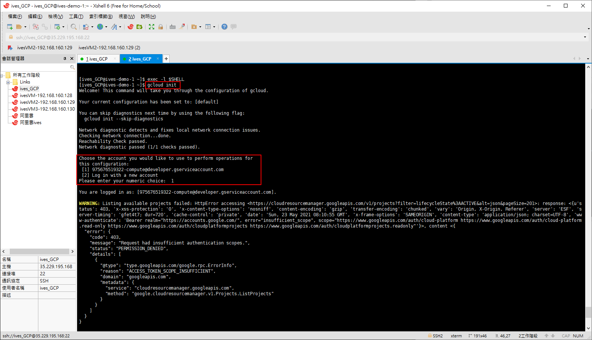
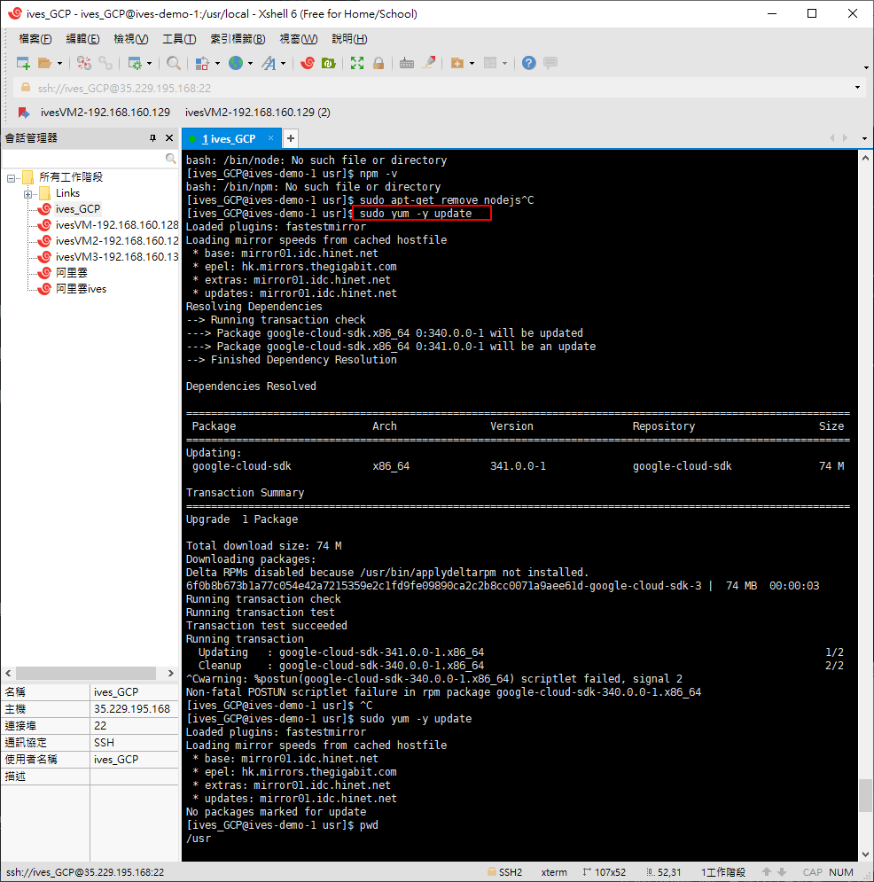
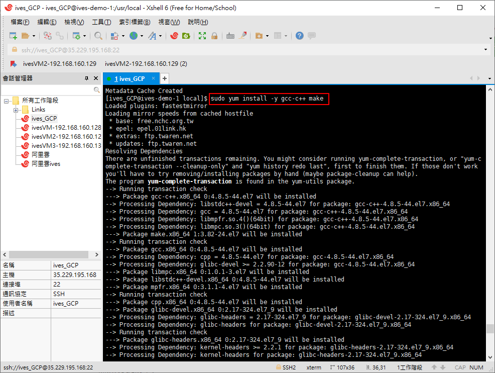
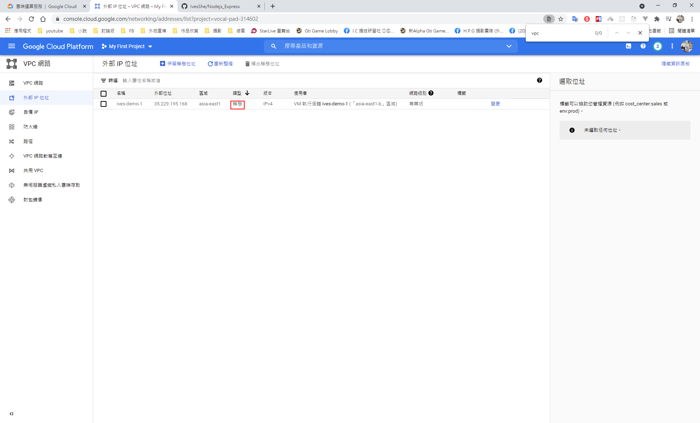

# GCP 搭配Nginx、Nodejs、Docker，並使用GoDaddy申請網域

Nodejs使用docker搭建運行

https://cloud.google.com/

# 完成網址

http://good.ivesshe.com/news

# 申請試用


# 建立機器


# 連線至機器

## 可以使用內建的瀏覽器登入


## 或使用gcloud登入


# 或使用XSHELL登入(之後都採用此方式)

設定參考網址

https://xunyi-huang.com/2020/10/09/%E9%80%8F%E9%81%8E-ssh-%E9%81%A0%E7%AB%AF-gcp-linux-%E7%B5%82%E7%AB%AF%E6%A9%9F/

連線完成畫面


# 安裝google SDK

```bash
curl https://sdk.cloud.google.com | bash
exec -l $SHELL
```


# 初始化

```bash
gcloud init
```
接著會需要登入google帳號跟選擇GCP專案。




可以輸入指令看一下當前的專案選擇和現在的登入帳號

```bash
gcloud config list
```


# 提升權限

直接拉到root

```bash
sudo su
```

或每次都加sudo(採用此方案)

# 安裝apt

下載apt-get

```bash
sudo curl https://raw.githubusercontent.com/dvershinin/apt-get-centos/master/apt-get.sh -o /usr/local/bin/apt-get
```

修改權限

```bash
sudo chmod 0755 /usr/local/bin/apt-get
```

若未修改環境變量，需這樣執行

```bash
/usr/local/bin/apt-get  install 包名
```


# 更新apt

```bash
sudo /usr/local/bin/apt-get update
```


# 處理一下apg-get環境

這邊將apt-get 拷貝一份到 /usr/local/sbin

```
cd /usr/local/sbin
sudo cp /usr/local/bin/apt-get ./
ll -l
```


經過這一步，就可以直接運行apg-get了

# 安裝node.js/npm

```bash
sudo curl -sL https://deb.nodesource.com/setup_12.x | sudo -E bash -

sudo apt-get install nodejs

node --version
```


版本跟預想中的不一樣(應該是12)

先刪除

```bash
sudo apt-get remove nodejs
```


## 在CentOS還是改用yum安裝吧...

```bash
sudo yum -y update
```



```bash
curl -sL https://rpm.nodesource.com/setup_12.x | sudo bash -
```


```bash
sudo yum clean all && sudo yum makecache fast
```


```bash
sudo yum install -y gcc-c++ make
```



```bash
sudo yum install -y nodejs
```


檢查版本，完成安裝了

```bash
node -v
npm -v
```


# 安裝git

```bash
sudo yum -y install git
```


```bash
git --version
```


# 捉之前nodejs的專案

```bash
git clone "https://github.com/IvesShe/Nodejs_Express.git"
```


初始化專案並運行

```
npm i
node app.js
```


# 開啟防火牆

設為靜態ip




設定防火牆


開啟3000端口


## 套用規則


# 訪問

可以訪問該服務了


## 安裝Docker

參考之前的文章

https://github.com/IvesShe/DockerStudy

安裝完成 


# 使用Docker建立服務


## 寫一個Dockerfile

```yml
FROM node:10-alpine

# Create app directory
WORKDIR /usr/src/app

# Install app dependencies
COPY package*.json ./
RUN apk --no-cache add --virtual builds-deps build-base python
RUN npm install

# Bundle app source
COPY . .

EXPOSE 3000
CMD [ "node", "index.js" ]
```

## 查看id


##　build指令格式 

指令格式 
```bash
docker build -t gcr.io/[your_gcp_project_id]/[your_image_name]:[tag_name] $PWD
```

```bash
sudo docker build -t gcr.io/vocal-pad-314602/nodejs_demo:0.1.0 $PWD
```


## 運行測試

```bash
sudo docker run -p 8080:3000 --name docker_node -d gcr.io/vocal-pad-314602/nodejs_demo:0.1.0
```

這邊開了8080的服務，所以要記得在防火牆規則中打開8080端口，才能訪問


http://35.229.195.168:8080/news

## 推上GCP

先啟動GCR的服務


指令格式 
```bash
gcloud docker -- push DOCKER_IMAGE_NAME:TAG
```

```bash
sudo gcloud docker -- push gcr.io/vocal-pad-314602/nodejs_demo:0.1.0
```

這邊會失敗，可能是試用帳號的關係

網頁設定端也要開啟，但權限不足


## pull

這邊先記錄，目前無法測試

```bash
gcloud auth configure-docker
```

```bash
gcloud docker -- pull gcr.io/vocal-pad-314602/nodejs_demo:0.1.0
```

```bash
docker run -p 3000:3000 --name node_app -d gcr.io/vocal-pad-314602/nodejs_demo:0.1.0
```

# 安裝nginx

安裝wget

```bash
sudo yum install wget
```

## 完整過程參考之前文章

https://github.com/IvesShe/PHP_FPM_Nginx_MySQL_Redis

https://github.com/IvesShe/NginxStudy


## 安裝pcre
```bash
sudo wget http://downloads.sourceforge.net/project/pcre/pcre/8.37/pcre-8.37.tar.gz
```

```bash
sudo tar -xvf pcre-8.37.tar.gz
cd pcre-8.37
sudo ./configure
sudo make && make install
sudo pcre-config --version
```

8.37裝失敗換8.42，後來發現把make及make install分開執行就可以順利安裝了
```bash
sudo wget https://sourceforge.net/projects/pcre/files/pcre/8.42/pcre-8.42.tar.gz
sudo tar -xvf pcre-8.42.tar.gz
cd pcre-8.42
sudo ./configure
sudo make 
sudo make install
sudo pcre-config --version
```


## 安裝nginx

```bash
sudo wget http://nginx.org/download/nginx-1.12.2.tar.gz
```

```bash
sudo tar -xvf nginx-1.12.2.tar.gz 
```

```bash
cd nginx-1.12.2
sudo ./configure
sudo make
sudo install
```


## 修改配置檔

server_name 及location / {
```yml
server {
        listen       80;
        server_name  localhost;

        #charset koi8-r;

        #access_log  logs/host.access.log  main;

        location / {
	    proxy_pass http://localhost:8080;
	    proxy_http_version 1.1;
            proxy_set_header Upgrade $http_upgrade;
            proxy_set_header Connection 'upgrade';
            proxy_set_header Host $host;
            proxy_cache_bypass $http_upgrade;
            #root   html;
            #index  index.html index.htm;
        }

```

重啟nginx

跳轉成功

http://35.229.195.168/news


# GoDaddy申請網域

https://tw.godaddy.com/


# 完成畫面

http://good.ivesshe.com/news


